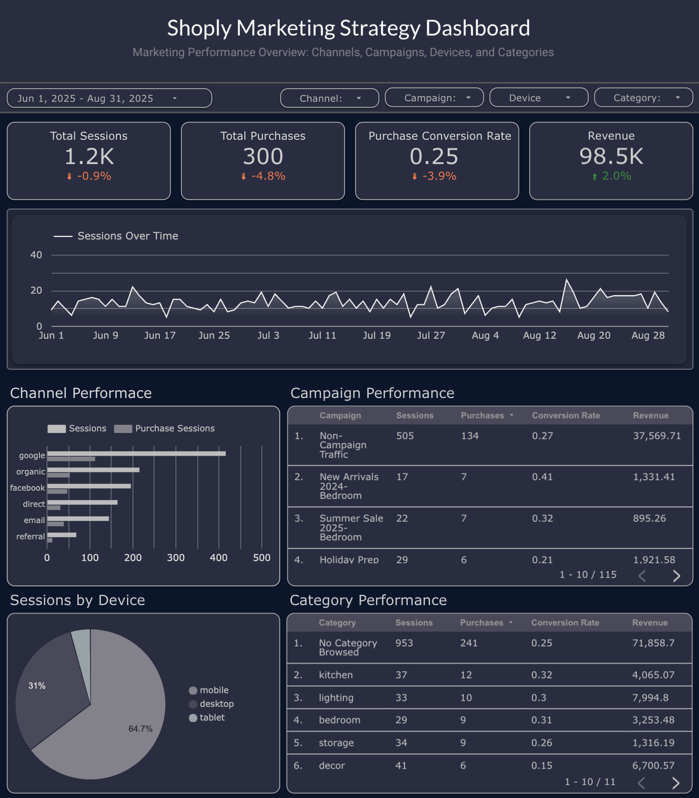

# 📊 Dashboard Layer

This folder contains documentation related to the **reporting and visualization layer** of the Marketing Analytics Pipeline project.

The dashboard is built using **Google Looker Studio** and serves as the final step of the analytics workflow, where cleaned and structured data is translated into visual insights.

---

# 📈 Dashboard Overview

The dashboard focuses on helping stakeholders understand marketing performance through key metrics and visual trends.

It highlights patterns across campaigns, user behavior, and revenue performance.

The goal of the dashboard is to make the underlying data easier to explore and interpret for decision making.

---

# 🔗 Dashboard Access

Looker Studio Dashboard:

<a href="https://lookerstudio.google.com/reporting/YOUR_DASHBOARD_LINK](https://lookerstudio.google.com/embed/reporting/1510c6bc-9e9b-4bf8-a47f-8947d2abfe3b/page/VyIqF" target="_blank">
Open the Interactive Dashboard
</a>

*https://lookerstudio.google.com/embed/reporting/1510c6bc-9e9b-4bf8-a47f-8947d2abfe3b/page/VyIqF*

---

## 🖼️ Dashboard Preview

# 📊 Key Metrics Included

The dashboard focuses on several core performance metrics, including:

- Total Sessions
- Total Conversions
- Conversion Rate
- Total Revenue
- Revenue per Campaign
- Campaign Performance Comparison
- User Demographic Insights

These metrics help provide a clearer picture of marketing performance across different segments.
